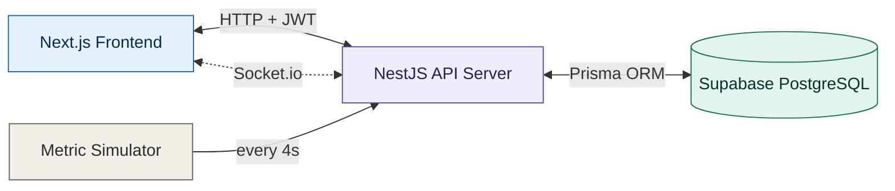

# 📊 Real-Time Analytics Dashboard (Full-Stack TypeScript)

<div align="center">

**A production-grade, Role-Based Access Control (RBAC), real-time analytics dashboard built with Next.js, NestJS, Socket.io & Prisma**

📈 Live Data Streaming • 🔐 JWT + RBAC • 🎯 Dynamic Filtering • 📤 CSV/PDF Export • 👥 Admin User Management 🐳 Docker Containerized • 🗄️ Supabase PostgreSQL

[](#-tech-stack)
[](#-tech-stack)
[](#-tech-stack)
[](https://github.com/razazaheer12/Real-Time-Analytics-Dashboard)

</div>

---

## 🌟 Overview

**Real-Time Analytics Dashboard** is a full-stack, enterprise-style business intelligence tool that simulates a live production analytics environment. It streams metrics in real time via WebSockets, enforces strict **role-based access control** (Admin / Analyst / Viewer), and gives administrators full control over user management — all wrapped in a clean, responsive, chart-driven UI.

Built end-to-end with a modern **TypeScript stack**: **Next.js (App Router)** on the frontend, **NestJS + Prisma + Socket.io** on the backend, and **Supabase (PostgreSQL)** as the cloud-hosted database.

---

## 🎯 Features

| Feature | Description |
|---|---|
| 🔐 **JWT Authentication** | Secure login with bcrypt password hashing, protected routes, and show/hide password toggle |
| 🛡️ **Role-Based Access Control (RBAC)** | Three roles — `ADMIN`, `ANALYST`, `VIEWER` — with backend-enforced route guards and role-scoped data visibility |
| 📈 **Live Data Visualization** | Interactive Line, Bar, and Pie charts (Recharts) for revenue trends, category breakdowns, and regional distribution |
| ⚡ **Real-Time Updates** | Socket.io-powered live metric streaming — charts update automatically every few seconds without refreshing |
| 🎯 **Dynamic Filtering** | Filter analytics by date range, category, and region, synced across charts and summary cards via Zustand |
| 📤 **CSV / PDF Export** | Admin-only export of filtered analytics reports, generated server-side with `json2csv` and `pdfkit` |
| 👥 **Admin User Management** | Full CRUD — Admins can create, edit, reset passwords for, and delete users directly from the dashboard |
| ⚙️ **Self-Service Profile Settings** | Every user can update their own name/email and change their password securely |
| 🔔 **Toast Notifications & Skeleton Loaders** | Polished UX with async feedback, loading states, and a global error boundary |
| 📱 **Responsive Layout** | Adaptive sidebar/navbar layout that adjusts cleanly across desktop and mobile viewports |

---

## 🛠️ Tech Stack

### Frontend
- ⚛️ **Next.js 16** (App Router) — Modern React framework with file-based routing
- 🔷 **TypeScript** — End-to-end type safety
- 🎨 **Tailwind CSS** — Utility-first responsive styling
- 📊 **Recharts** — Declarative, composable charting library
- 🐻 **Zustand** — Lightweight global state management for filters
- 🔌 **Socket.io-client** — Real-time WebSocket communication
- 🌐 **Axios** — HTTP client with JWT interceptors

### Backend
- 🐦 **NestJS** — Modular, scalable Node.js framework
- 🔌 **Socket.io** — WebSocket gateway with JWT-authenticated, role-based rooms
- 🗄️ **Prisma ORM** — Type-safe database access layer
- 🔑 **JWT + Passport** — Stateless authentication for both REST and WebSocket connections
- 🔒 **bcrypt** — Secure password hashing
- 📄 **json2csv / pdfkit** — Server-side report generation

### Database
- 🐘 **Supabase (PostgreSQL)** — Cloud-hosted relational database with pooled + direct connections

---

## ⚡ System Architecture



### Workflow

Users authenticate through the Next.js frontend against JWT-secured NestJS REST endpoints. Once authenticated, the Socket.io client establishes a WebSocket connection (also JWT-verified) and joins a role-specific room. A backend interval service continuously generates simulated metrics, persists them via Prisma to Supabase, and emits them live to connected clients — updating charts in real time without polling.

---

## 📂 Project Structure

```
realtime-analytics-dashboard/
├── backend/
│   ├── src/
│   │   ├── auth/             # JWT strategy, guards, decorators, login/register
│   │   ├── users/             # Profile management & admin user CRUD
│   │   ├── metrics/           # Filtered analytics REST API
│   │   ├── realtime/          # Socket.io gateway + live data simulator
│   │   ├── export/            # CSV/PDF report generation
│   │   ├── prisma/            # Prisma service/module
│   │   └── common/            # Global exception filter
│   ├── prisma/
│   │   ├── schema.prisma
│   │   └── seed.ts
│   └── package.json
│
└── frontend/
    ├── src/
    │   ├── app/
    │   │   ├── (auth)/login/          # Login page
    │   │   └── (dashboard)/           # Dashboard, Settings, Admin Users
    │   ├── components/
    │   │   ├── charts/                 # Line, Bar, Pie chart components
    │   │   ├── filters/                 # Date/Category/Region filters
    │   │   ├── export/                   # Export buttons
    │   │   └── layout/                    # Sidebar, Navbar
    │   ├── context/                        # AuthContext, ToastContext
    │   ├── hooks/                            # useSocket, useMetrics, useUsers
    │   ├── store/                              # Zustand filter store
    │   └── lib/                                  # Axios instance, Socket client
    └── package.json
```

---

## 🚀 Getting Started Locally

### Prerequisites
- Node.js 18+
- A Supabase account (free tier)

### 1️⃣ Clone the repository
```bash
git clone <your-repo-url>
cd realtime-analytics-dashboard
```

### 2️⃣ Backend Setup
```bash
cd backend
npm install
```

Create a `.env` file in `backend/`:
```env
DATABASE_URL="postgresql://postgres.<ref>:<password>@<pooler-host>:6543/postgres?pgbouncer=true"
DIRECT_URL="postgresql://postgres.<ref>:<password>@<pooler-host>:5432/postgres"
JWT_SECRET="your_jwt_secret"
JWT_EXPIRES_IN="1d"
```

Run migrations and seed the database:
```bash
npx prisma migrate dev --name init
npx prisma db seed
```

Start the backend:
```bash
npm run start:dev
```

Backend runs at `http://localhost:3001` 🚀

### 3️⃣ Frontend Setup
```bash
cd frontend
npm install
```

Create a `.env.local` file in `frontend/`:
```env
NEXT_PUBLIC_API_URL=http://localhost:3001
```

Start the frontend:
```bash
npm run dev
```

The app will be live at `http://localhost:3000` 🎉

### 4️⃣ Test Accounts (from seed script)
| Role | Email | Password |
|---|---|---|
| Admin | `admin@test.com` | `test123` |
| Viewer | `viewer@test.com` | `test123` |

---

## 🔌 REST API Endpoints

| Endpoint | Method | Access | Description |
|---|---|---|---|
| `/auth/register` | POST | Public | Register a new account |
| `/auth/login` | POST | Public | Login and receive JWT |
| `/metrics` | GET | Authenticated | Filtered metrics list (role-scoped) |
| `/metrics/summary` | GET | Authenticated | Aggregated revenue summary |
| `/metrics/categories` | GET | Authenticated | List of categories |
| `/metrics/regions` | GET | **Admin only** | List of regions |
| `/export/csv` | GET | **Admin only** | Download filtered report as CSV |
| `/export/pdf` | GET | **Admin only** | Download filtered report as PDF |
| `/users/me` | GET / PATCH | Authenticated | View/update own profile |
| `/users/me/password` | PATCH | Authenticated | Change own password |
| `/users` | GET / POST | **Admin only** | List / create users |
| `/users/:id` | PATCH / DELETE | **Admin only** | Update / delete a user |

## 🔌 Socket.io Events

| Event | Direction | Description |
|---|---|---|
| `connect` | Client ↔ Server | JWT-authenticated handshake, joins role-based room |
| `metric:new` | Server → Client | Emits a newly generated live metric every ~4 seconds |

---

## 🛡️ Role-Based Access Control

| Capability | Admin | Analyst | Viewer |
|---|---|---|---|
| View dashboard & charts | ✅ | ✅ | ✅ (last 7 days only) |
| Region filter & breakdown | ✅ | ❌ | ❌ |
| Export CSV/PDF | ✅ | ❌ | ❌ |
| Manage users (CRUD) | ✅ | ❌ | ❌ |
| Edit own profile/password | ✅ | ✅ | ✅ |

---

## 📸 Preview

> 💡 Add your own screenshots here before publishing — e.g. Login page, Dashboard (Admin view), Dashboard (Viewer view), Manage Users page.

### Login Page


### Dashboard — Admin View


### Dashboard — Viewer View (Restricted)


### Admin — Manage Users


---

## 🗺️ Roadmap / Future Improvements

- [ ] Deploy backend to a persistent Node.js host (Socket.io requires long-running processes, not serverless)
- [ ] httpOnly cookie-based auth for stronger XSS protection
- [ ] Pagination for large metric datasets
- [ ] Unit & E2E test coverage

---

## 👤 Author

**Raza Zaheer**

- 🌐 **Portfolio:** [raza-zaheer-portfolio-web-developer.vercel.app](https://raza-zaheer-portfolio-web-developer.vercel.app)
- 💼 **GitHub:** [@razazaheer12](https://github.com/razazaheer12)

---

## 📄 License

This project is open-source and available for learning and personal use.

---

<div align="center">

### ⭐ If you found this project helpful, consider giving it a star!

Built step-by-step, one day at a time — full-stack, real-time, and role-aware.

</div>
